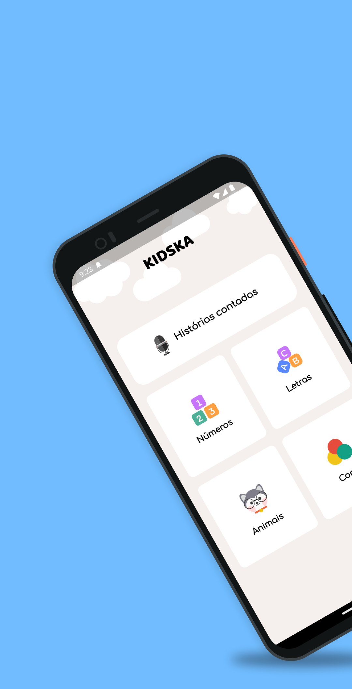
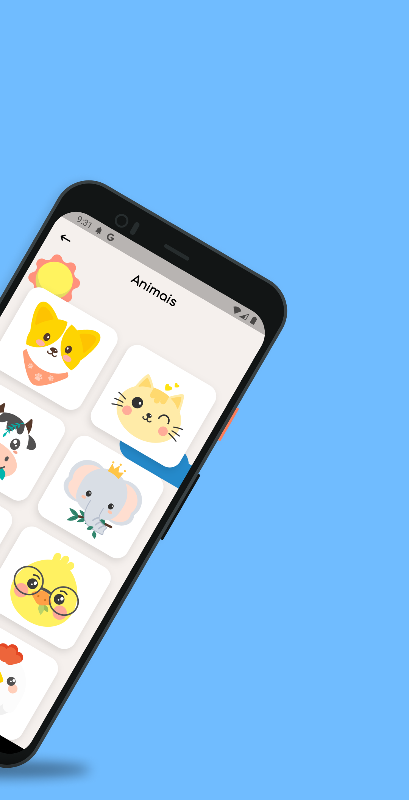
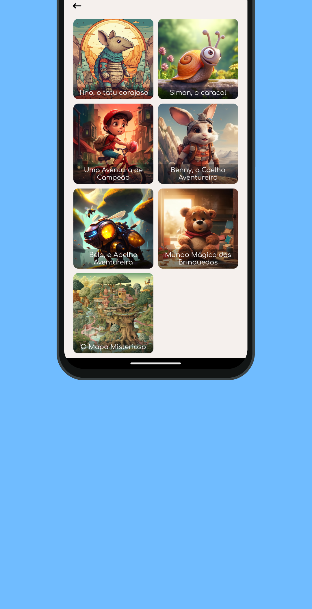

# KIDSKA APP

Um aplicativo para ajudar a crianças a aprenderem sobre alfabeto, números, cores e animais. Com sons e imagens para facilitar o aprendizado.
Também possui uma lista de histórias infantis divertidas para as crianças, com muita aventura e diversão.

 
 

    

 
 

## Telas

 

